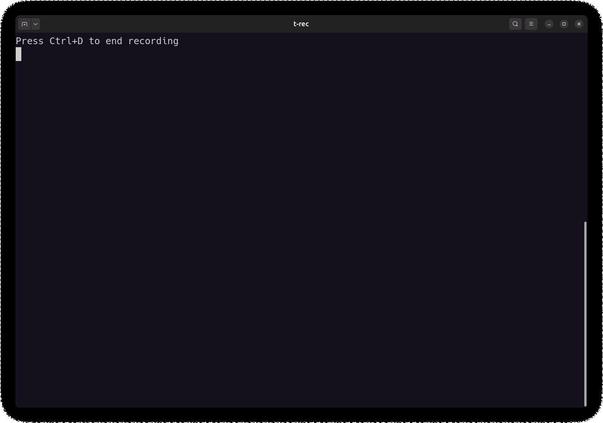

# Neovim Configuration Guide



This is a highly customized Neovim configuration written in Lua, using lazy.nvim as the plugin manager. The configuration includes a rich set of functional modules, including UI enhancements, code completion, LSP, debugging, and more.

## Instructions

To use this Neovim configuration, follow these steps:

1. Ensure the following software is installed, and use the following command to install them:

   ```bash
   sudo apt-get update
   sudo apt-get install -y \
       neovim \
       git \
       curl \
       sudo \
       software-properties-common \
       python3 \
       python3-pip \
       g++ \
       gcc \
       build-essential \
       npm \
       unzip \
       clang-format
   ```

2. Clone this repository to the `~/.config/nvim` directory:
   ```bash
   git clone https://github.com/HuangJunLin8/nvim ~/.config/nvim
   ```
3. Start Neovim, and the plugins will be installed automatically.
4. Use the provided shortcuts and functional modules to enhance your editing experience.

## Using Dockerfile

You can use the provided Dockerfile to quickly set up a Docker container with this Neovim configuration (the built image is 1.48G). Here are the steps:

1. Build the Docker image:
   ```bash
   docker build -t my-neovim .
   ```

2. Run the Docker container:
   ```bash
   docker run -it --rm my-neovim
   ```

   This will start a container with Neovim, where you can use the configured Neovim.

## Shortcut Keys

### Window Management
- `sl`: Vertical split
- `sh`: Horizontal split  
- `ss`: Close current window
- `so`: Close other windows
- `<A-h/j/k/l>`: Navigate between windows
- `s,`/`s.`: Adjust window width
- `sj`/`sk`: Adjust window height
- `s=`: Equalize window sizes

### File Operations
- `<A-m>`: Toggle file tree (NvimTree)
- `<leader>s`: Save file
- `<C-s>`: Save file

### Tab Operations
- `<leader>h`: Switch to the left tab
- `<leader>l`: Switch to the right tab  
- `<leader>q`: Close current tab
- `<leader>wl`: Close all tabs to the right (excluding current)
- `<leader>wh`: Close all tabs to the left (excluding current)
- `<leader>wc`: Interactively choose a tab to close

### Terminal Operations
- `<leader>t`: Open terminal in horizontal split
- `<leader>vt`: Open terminal in vertical split
- `<Esc>`: Exit terminal mode
- `<A-h/j/k/l>`: Navigate between terminal windows

### Code Editing
- `<C-_>`: Comment/uncomment current line
- `<leader>f`: Format code using Formatter
- `gcc`: Comment/uncomment current line
- `gc`: Comment/uncomment selected lines
- `<leader>a`: Copy entire file content
- `J`/`K`: Move selected text up/down
- `<C-j>`/`<C-k>`: Quick move up/down
- `<C-u>`/`<C-d>`: Quick scroll up/down
- `<C-h>`: Jump to line start
- `<C-l>`: Jump to line end
- `q`: Close current window
- `qq`: Save and exit
- `Q`: Force exit
- `jj`: Exit insert mode
- `<C-Left>`/`<C-Right>`: Adjust window width
- `<C-Up>`/`<C-Down>`: Adjust window height
- `p`: Paste without overwriting clipboard

### Search Functions
- `<C-p>`: File search (Telescope)
- `<C-f>`: Content search (Telescope)
- `<leader>fe`: Environment variable search (Telescope)
- `<C-j>`: Move to next selection
- `<C-k>`: Move to previous selection
- `<C-n>`: Cycle history to next
- `<C-p>`: Cycle history to previous
- `<C-q>`: Close search window
- `<C-u>`: Scroll preview up
- `<C-d>`: Scroll preview down

### LSP Functions
- `gd`: Go to definition
- `gD`: Go to declaration
- `gi`: Go to implementation
- `gr`: Show references
- `gh`: Hover documentation
- `gp`: Show diagnostic information
- `gk`: Previous diagnostic
- `gj`: Next diagnostic
- `<leader>rn`: Rename symbol
- `<leader>ca`: Code actions
- `<leader>p`: Open terminal
- `<A-.>`: Trigger completion
- `<A-,>`: Cancel completion
- `<CR>`: Confirm selection
- `<C-k>`: Previous option
- `<C-j>`: Next option
- `<C-d>`: Scroll document down
- `<C-u>`: Scroll document up
- `<C-l>`: Insert snippet
- `<C-h>`: Previous snippet
- `<Tab>`: Smart completion
- `<S-Tab>`: Previous completion item

### Debugging Functions
- `<leader>cc`: Select Python virtual environment
- `<leader>rr`: Run code
- `<leader>rf`: Run file
- `<leader>rft`: Run file in new tab
- `<leader>rp`: Run project
- `<leader>rc`: Close run
- `<leader>crf`: Set file type
- `<leader>crp`: Set project

## Plugin List

- UI Enhancements: tokyonight.nvim, nvim-tree, bufferline.nvim, lualine.nvim
- Core Features: telescope.nvim, nvim-treesitter
- LSP: mason.nvim, nvim-lspconfig, nvim-cmp
- Debugging: nvim-dap, mason-nvim-dap.nvim
- Python: venv-selector.nvim

## Project Structure

```
.
├── init.lua                # Neovim initialization configuration file
├── lazy-lock.json          # Plugin lock file
├── lua                     # Lua configuration directory
│   ├── basic.lua           # Basic configuration
│   ├── colorscheme.lua     # Colorscheme configuration
│   ├── keybindings.lua     # Keybindings configuration
│   ├── plugin-config       # Plugin configuration directory
│   │   ├── code            # Code-related plugin configuration
│   │   │   ├── code_runner.lua
│   │   │   ├── flash.lua
│   │   │   ├── formatter.lua
│   │   │   └── nvim-treesitter.lua
│   │   ├── dap             # Debugging-related plugin configuration
│   │   │   ├── cpp.lua
│   │   │   ├── init.lua
│   │   │   └── python.lua
│   │   ├── lsp             # LSP-related plugin configuration
│   │   │   ├── cmp.lua
│   │   │   ├── init.lua
│   │   │   ├── lsp_ui.lua
│   │   │   └── mason.lua
│   │   ├── telescope.lua   # Telescope plugin configuration
│   │   └── ui              # UI-related plugin configuration
│   │       ├── blankline.lua
│   │       ├── bufferline.lua
│   │       ├── dashboard.lua
│   │       ├── lualine.lua
│   │       ├── nvim-tree.lua
│   │       ├── rainbow.lua
│   │       └── toggleterm.lua
│   └── plugins.lua         # Plugin management configuration
└── README.md               # Project description file
